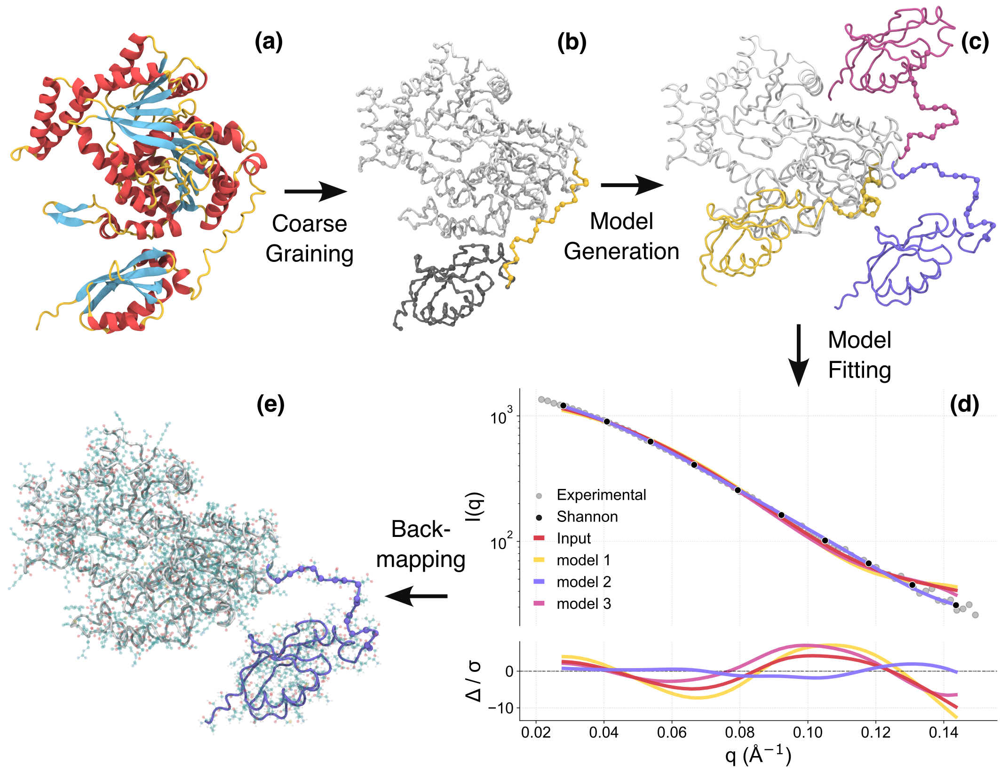

# Carbonara

Carbonara bridges the gap between crystal-like and solution-state conformations by efficiently refining protein structures using experimental SAXS (Small Angle X-ray Scattering) data. Starting from AI-predicted models or crystallographic structures, Carbonara rapidly explores conformational space to identify physiologically relevant solution-state conformations. The method can incorporate additional experimental constraints such as disulfide bonds, NMR distance measurements, or FRET data to further guide the refinement process.

<p align="center">
  
</p>

Schematic representation of the Carbonara refinement pipeline. The workflow proceeds from an initial structure (a) with identification of flexible regions (b), conformational sampling guided by SAXS data constraints (c), model selection based on optimal fit (d), and finally all-atom reconstruction (e) for downstream applications.

## Building with CMake

To build the project using CMake, follow these steps:


1. Open a terminal and make sure you have CMake installed on your system (version 3.10 or higher is recommended)

```
cmake -version
```

2. Navigate to the carbonara root directory:

```
cd path/to/carbonara
```

3. Inside the carbonara directory, create a build directory and navigate into it:

```
mkdir build
cd build
```

4. Generate the build files:

```
cmake ..
```

5. Build the project:

```
make
```

## Reproducing structures refined in the paper

To reproduce the refinement of the two structures presented in the paper, first ensure you are located in `/path/to/carbonara` then run the following: 

#### human SMARCAL1

```
sh RunMe_humanSMARCAL1.sh
```

#### ChiLob7/4 IgG2
```
sh RunMe_C239S.sh
```

## Using Carbonara for new structures

To refine protein structure predictions with your own SAXS data, you'll need:

1. A PDB starting model (AlphaFold or crystal structure recommended)
2. SAXS experimental data in Å units with three columns: q, I, and I error

### Setting up the Python environment

```bash
# Create a new conda environment
conda create -n carbonara_py python=3.10
conda activate carbonara_py

# Install required packages
pip install pandas 
pip install numpy 
pip install cython 
pip install tqdm 
pip install mdtraj 
pip install biobox
pip install plotly
```

Setting up the RunMe

```bash
python setup_carbonara.py --pdb path/to/pdb --saxs path/to/saxs --name ProteinName 
```
```bash
# Optional flags for customising refinement
--fit_n_times INT     Number of times to run the fit (default: 5)
--min_q FLOAT         Minimum q-value (default: 0.01)
--max_q FLOAT         Maximum q-value (default: 0.2)
--max_fit_steps INT   Maximum number of fitting steps (default: 1000)
--pairedQ             Use paired predictions
--rotation            Apply affine rotations

```

Then run:

```bash

sh RunMe_*ProteinName*.sh

```
## Colab implementaion

A colab implementation of the setup which features graphical interactivity and a guided walkthourgh of the setup can be found here

https://colab.research.google.com/drive/1l0ncymMdAFEovUpluW5y-gkX9-AzWREv#scrollTo=1Pe-wUqNQvPX

Please make a copy. You can run the code in colab but also download the fitting folders and script.


## Citation

If you use Carbonara in your research, please cite our preprint!

```bibtex
@article{carbonara2025,
  title={Carbonara: A Rapid Method for SAXS-Based Refinement of Protein Structures},
  author={McKeown, J. and Bale, A. and Brown, C. and Fisher, H. and Rambo, R. and Essex, J. and Degiacomi, M. and Prior, C.},
  journal={ResearchSquare},
  year={2025},
  doi={10.21203/rs.3.rs-6447099/v1},
  url={https://doi.org/10.21203/rs.3.rs-6447099/v1}
}

```

Shield: [![CC BY-NC-SA 4.0][cc-by-nc-sa-shield]][cc-by-nc-sa]

This work is licensed under a
[Creative Commons Attribution-NonCommercial-ShareAlike 4.0 International License][cc-by-nc-sa].

[![CC BY-NC-SA 4.0][cc-by-nc-sa-image]][cc-by-nc-sa]

[cc-by-nc-sa]: http://creativecommons.org/licenses/by-nc-sa/4.0/
[cc-by-nc-sa-image]: https://licensebuttons.net/l/by-nc-sa/4.0/88x31.png
[cc-by-nc-sa-shield]: https://img.shields.io/badge/License-CC%20BY--NC--SA%204.0-lightgrey.svg
