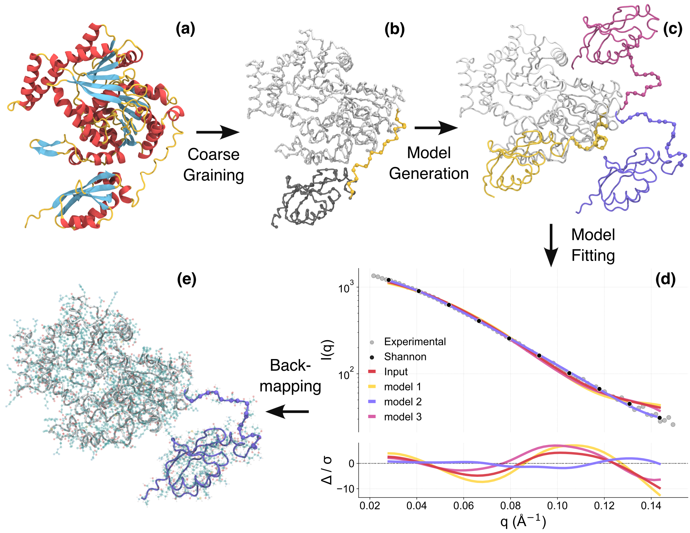

# Carbonara



Carbonara is a SAXS-guided protein-structure refinement pipeline for exploring solution-state conformations starting from AlphaFold models, crystal structures, or other structural predictions.

Carbonara combines:

- a fast C++ Cα-level conformational search;
- automatic preparation of Carbonara coordinate, fingerprint and SAXS input files;
- optional user-defined flexibility, rigid-body rotations and distance constraints;
- automated all-atom backmapping of generated Cα structures;
- real-time pyFoXS scoring;
- automated multi-state fitting using an approximate MultiFoXS-style SAXS model.

Carbonara is especially useful when a starting structure is locally plausible but does not explain the experimental SAXS profile in solution, for example because of domain motion, hinge flexibility, multimer rearrangement or conformational mixtures.

---

## Recommended workflow

For most users, we recommend the notebook/front-end workflow rather than calling the C++ executable directly. The notebook workflow prepares the Carbonara input files, launches fitting runs, monitors all-atom backmapping, performs pyFoXS scoring, and provides analysis and visualisation utilities.

Use:

- `runCarbonara.ipynb` for a standard monomer or single-chain guided run;
- `runCarbonaraUserFlex.ipynb` when you want to manually choose flexible/fixed sections;
- `runCarbonaraMultimer.ipynb` for multimers, locked rigid-body units, distance constraints, and multi-structure SAXS fitting.

The core C++ executable can still be run directly from generated `RunMe_*.sh` scripts, but this is mainly useful for reproducing prepared runs or for advanced users.

---

## Which Carbonara workflow should I use?

| Workflow | Use when | Main features |
|---|---|---|
| Core C++ engine | You already have prepared Carbonara input files and a `RunMe_*.sh` script | Fast Cα-level SAXS-guided fitting |
| Basic setup / one-shot | You have a PDB/mmCIF and SAXS curve and want a quick default run | Automatic input generation and fitting |
| Full notebook / all-atom workflow | You want live monitoring, all-atom models, pyFoXS scoring, custom flexibility, constraints, multimers or mixtures | Guided setup, watcher, backmapping, FoXS scoring, visualisation and analysis |
| Multimer / multi-state workflow | You have multiple chains, locked domains, constrained assemblies or conformational mixtures | Rigid-body rotations, distance constraints, `mixture_n`, and approximate MultiFoXS-style ensemble scoring |

For new users, start with the notebook workflow. For complex systems, use `runCarbonaraMultimer.ipynb`.

---

## Main components

Carbonara has three linked stages.

### 1. Cα-level SAXS-guided search

The core C++ code generates and refines Cα-level conformations against a SAXS profile. Flexible linker sections can be chosen automatically or manually. Rigid sections can be preserved, and optional distance constraints can be supplied.

### 2. All-atom monitoring and pyFoXS scoring

The watcher monitors the fitting output directory. When new Cα predictions appear, it backmaps them to all-atom structures using the selected backend and optionally runs pyFoXS.

For ordinary single-structure runs, pyFoXS scores each prediction independently.

### 3. Multi-state / mixture scoring

For `mixture_n > 1`, the watcher groups structures belonging to the same run and step, backmaps each component, and scores the grouped state as a multi-state model.

---

## Notebooks

| Notebook | Best for | Demonstrates |
|---|---|---|
| `runCarbonara.ipynb` | Standard guided Carbonara setup | Single-state SAXS-guided refinement |
| `runCarbonaraUserFlex.ipynb` | User-defined flexibility | Manual flexible/fixed section selection |
| `runCarbonaraMultimer.ipynb` | Multimers, constrained assemblies and multi-state fitting | Locked rotations, distance constraints, `mixture_n`, and approximate MultiFoXS-style scoring |

### `runCarbonaraMultimer.ipynb`

This notebook demonstrates the advanced workflow for multimeric systems and conformational mixtures. It is the recommended route when:

- chains or domains should move as locked rigid units;
- motion is restricted by hinges, disulfides, contacts or other constraints;
- the experimental SAXS profile may represent a mixture of states;
- several structures should be fitted together using `mixture_n`.

The notebook shows how to prepare repeated coordinate/fingerprint/constraint files for multi-structure fitting, launch the monitored all-atom workflow, inspect mixture weights, plot approximate MultiFoXS-style fits, and export selected PDBs.

---

## Installation and setup

Clone the repository:

```bash
git clone https://github.com/Prior-Lab-Durham-University/carbonara.git
cd carbonara
```

Build the C++ executable:

```bash
mkdir -p build
cd build
cmake ..
make
cd ..
```

The expected executable location is:

```text
build/bin/predictStructureQvary
```

Set up the Python environment used by the notebooks and watcher. The exact setup depends on your system, but the environment should include at least:

```bash
python -m pip install numpy scipy pandas matplotlib tqdm biopython mdtraj py3Dmol pdbfixer openmm numba
```

The pyFoXS wrapper must use the same Python environment as the notebook/watcher. Check with:

```bash
which pyfoxs
head -20 $(which pyfoxs)
python -c "import numba; print(numba.__version__)"
```

Inside notebooks, prefer commands based on `sys.executable` so subprocesses use the active kernel environment.

---

## Quick start

A typical notebook workflow is:

```python
import sys
from pathlib import Path

import fittingAnalysis as fa
import CarbonaraDataTools as CDT

print(sys.executable)
```

Prepare a run using one of the notebooks or the setup script. For available options:

```bash
python setup_carbonara_allAtom.py --help
```

Then launch the generated run script:

```bash
bash RunMe_<name>.sh
```

or launch it from the notebook front end.

---

## Single-structure fitting

For ordinary runs, Carbonara generates one prediction per run/step:

```text
mol7_sub_0_step_12_xyz.dat
```

The watcher backmaps this to:

```text
fitdata/allAtomRun7/mol7_sub_0_step_12_xyz_CA.pdb
fitdata/allAtomRun7/mol7_sub_0_step_12_xyz_AA.pdb
```

If FoXS scoring is enabled, scores are written to:

```text
fitdata/allAtomRun7/foxs_results.txt
```

The analysis utilities can then collect good predictions:

```python
good_preds = fa.collect_good_prediction_files(
    fitdata_dir="carbonara_runs/MyProtein/fitdata",
    chi2_threshold=2.0,
    return_records=True,
)
```

or one best prediction per independent run:

```python
best_preds = fa.collect_best_prediction_per_run_closest_to_one(
    fitdata_dir="carbonara_runs/MyProtein/fitdata",
    return_records=True,
)
```

---

## Multi-state fitting and approximate MultiFoXS scoring

Carbonara can fit multiple conformational states simultaneously using the `mixture_n` option. In this mode, each fitting state contains several generated structures:

```text
mol7_sub_0_step_12_xyz.dat
mol7_sub_1_step_12_xyz.dat
mol7_sub_2_step_12_xyz.dat
```

These files are treated as one grouped multi-state prediction for run 7, step 12.

After Cα fitting, the watcher backmaps each component to all-atom form:

```text
fitdata/allAtomRun7/mol7_sub_0_step_12_xyz_AA.pdb
fitdata/allAtomRun7/mol7_sub_1_step_12_xyz_AA.pdb
fitdata/allAtomRun7/mol7_sub_2_step_12_xyz_AA.pdb
```

For `mixture_n > 1`, Carbonara does not simply score each component independently. Instead, it performs an approximate MultiFoXS-style fit. Each component is converted into a pyFoXS partial profile, and the grouped state is fitted as

\[
I_{\rm mix}(q)
=
C \sum_i w_i I_i(q;c_1,c_2),
\]

where

\[
w_i \ge 0,
\qquad
\sum_i w_i = 1.
\]

The mixture fit optimises:

- the non-negative state weights `w_i`;
- one shared FoXS excluded-volume parameter `c1`;
- one shared hydration-layer parameter `c2`;
- one global scale factor `C`.

This avoids fitting each component separately to the SAXS curve before mixture fitting. The ensemble is scored as a single multi-state model.

Mixture results are written to:

```text
fitdata/allAtomRunN/foxs_mixture_results.txt
```

with lines such as:

```text
mol7_step_12 chi2=1.23 scale=... c1=... c2=... weights=0.2,0.8 pdbs=...
```

The fitted mixture curve is written as:

```text
fitdata/allAtomRunN/mol7_step_12_foxs_mixture_fit.dat
```

and can be plotted with the analysis utilities in `fittingAnalysis.py`.

Example analysis:

```python
best_preds = fa.collect_best_prediction_per_run_closest_to_one(
    fitdata_dir="carbonara_runs/MyProtein/fitdata",
    return_records=True,
)

best_preds[0]
```

A multi-state record contains:

```python
record["type"]          # "mixture"
record["chi2"]          # fitted mixture chi^2
record["pdb_paths"]     # component all-atom PDBs
record["weights"]       # fitted mixture weights
record["c1"]            # shared FoXS c1
record["c2"]            # shared FoXS c2
record["fit_file"]      # fitted SAXS mixture curve
record["profile_paths"] # pyFoXS profile/partial-profile files
```

Plot the fitted SAXS curve:

```python
fa.plot_prediction_foxs_fit(best_preds[0])
```

Visualise the component structures:

```python
fa.visualisePredictionIndividual(best_preds[0])
```

---

## Search modes: exhaustive versus early-stopping

Carbonara supports two practical run modes.

### 1. Exhaustive / fixed-step search

This is the default production mode. Each independent fitting run continues until the specified maximum number of fitting steps is reached.

Use this when:

- you want broad exploration of conformational space;
- you are building an ensemble of candidate structures;
- you want to analyse the diversity of good solutions;
- you do not yet know what SAXS score is realistically achievable.

This is the recommended mode for final production searches.

### 2. Stop-on-good-fit screening

In screening mode, the watcher can terminate an individual fitting run once an all-atom FoXS or mixture-FoXS score is good enough.

This is useful for rapid searches where you want to stop runs that have already found an acceptable model. It is not the default recommendation for final production searches, because later structures may still improve the fit or reveal alternative conformations.

Example options:

```bash
--terminate-on-foxs \
--terminate-threshold 1.5 \
--terminate-confirmation-count 1
```

Choose the threshold conservatively. If you ultimately need `chi2 < 2`, it is usually better to set the stopping threshold lower than 2, because a run stopped too early will not explore later potentially better conformations.

For exploratory production runs, prefer the fixed-step mode.

---

## Distance constraints and varying sections

The multimer workflow can use fixed-distance constraints and manually chosen varying sections.

For multi-structure runs, the setup should contain matching numbered files:

```text
coordinates1.dat
coordinates2.dat
coordinates3.dat

fingerPrint1.dat
fingerPrint2.dat
fingerPrint3.dat

varyingSectionSecondary1.dat
varyingSectionSecondary2.dat
varyingSectionSecondary3.dat

fixedDistanceConstraints1.dat
fixedDistanceConstraints2.dat
fixedDistanceConstraints3.dat
```

For `mixture_n = 3`, each component needs its own numbered coordinate, fingerprint, varying-section and constraint file. In many applications these files are initially identical, but Carbonara expects the numbering to be present.

---

## Outputs

A typical all-atom monitored run produces:

```text
carbonara_runs/<name>/
    Saxs.dat
    coordinates1.dat
    fingerPrint1.dat
    mixtureFile.dat
    RunMe_<name>.sh
    fitdata/
        fitLog1.dat
        fitLog2.dat
        ...
        mol1_sub_0_step_..._xyz.dat
        mol1_sub_1_step_..._xyz.dat
        ...
        allAtomRun1/
            *_CA.pdb
            *_AA.pdb
            *_foxs.log
            foxs_results.txt
            foxs_mixture_results.txt
            *_foxs_mixture_fit.dat
            *_foxs_component_curves.dat
```

For single-structure runs, FoXS scores are stored in:

```text
allAtomRunN/foxs_results.txt
```

For multi-state runs, grouped approximate MultiFoXS-style scores are stored in:

```text
allAtomRunN/foxs_mixture_results.txt
```

---

## Analysis examples

Load the analysis tools:

```python
import fittingAnalysis as fa
```

Collect all predictions below a threshold:

```python
good_preds = fa.collect_good_prediction_files(
    fitdata_dir="carbonara_runs/MyProtein/fitdata",
    chi2_threshold=2.0,
    return_records=True,
)
```

Collect the best prediction per independent run:

```python
best_preds = fa.collect_best_prediction_per_run_closest_to_one(
    fitdata_dir="carbonara_runs/MyProtein/fitdata",
    return_records=True,
)
```

Plot the SAXS/FoXS fit:

```python
fa.plot_prediction_foxs_fit(best_preds[0])
```

Visualise a prediction:

```python
fa.visualisePredictionIndividual(best_preds[0])
```

Compute individual component radii of gyration:

```python
rg_components = fa.calc_rg_distribution(
    pdb_files=best_preds,
    rg_func=fa.radius_of_gyration,
    weighted=False,
)
```

Compute weighted mixture radii of gyration:

```python
rg_weighted = fa.calc_rg_distribution(
    pdb_files=best_preds,
    rg_func=fa.radius_of_gyration,
    weighted=True,
)
```

Compare component structures against a reference:

```python
metrics_vs_ref = fa.structure_metrics_vs_reference(
    best_preds,
    ref_pdb="pdbFiles/reference.pdb",
    compare_func=fa.compare_structures_vals,
)
```

For RMSD, TM-score and GDT-TS analyses, mixture records are flattened and compared component-by-component. No structural weighted average is attempted.

---

## Exporting selected PDBs

The analysis tools can export selected predictions to a zip file.

Organised export with folders and a manifest:

```python
zip_path, manifest = fa.zip_prediction_pdbs(
    best_preds,
    zip_name="best_predictions.zip",
)
```

Flat export for external MultiFoXS-style input:

```python
zip_path, manifest = fa.zip_prediction_pdbs(
    best_preds,
    zip_name="multifoxs_input.zip",
    flat=True,
    include_manifest=False,
)
```

The flat zip contains only PDB files at the top level, for example:

```text
mol1_sub_0_step_25_xyz_AA.pdb
mol1_sub_1_step_25_xyz_AA.pdb
mol1_sub_2_step_25_xyz_AA.pdb
```

No `.pdb.dat` FoXS profile files are included in the flat export.

---

## Troubleshooting

### pyFoXS cannot import `numba`

Make sure the `pyfoxs` wrapper is using the same Python environment as the notebook or run script:

```bash
which pyfoxs
head -20 $(which pyfoxs)
python -c "import numba; print(numba.__version__)"
```

If the notebook uses a virtual environment, the run script and watcher should use the same Python executable as the notebook kernel.

Inside a notebook:

```python
import sys
from pathlib import Path

foxs_cmd = str(Path(sys.executable).parent / "pyfoxs")
print(foxs_cmd)
```

### py3Dmol viewer is blank

py3Dmol requires browser WebGL support. If HTML output works but the 3D viewer is blank, test WebGL in the browser.

If WebGL fails in Chrome but works in Firefox, the issue is the browser/GPU session rather than Carbonara or the PDB file. Clearing notebook outputs, restarting the browser, or switching browser usually resolves this.

Large notebooks with many py3Dmol viewers can exhaust browser WebGL contexts. Use:

```text
Kernel -> Restart Kernel and Clear All Outputs
```

then refresh the browser tab.

### Mixture records contain `.pdb.dat` files

`foxs_mixture_results.txt` contains both `pdbs=` and `profiles=` fields. Analysis tools should use `pdbs=` for structures and `profiles=` only for FoXS profile data.

If `.pdb.dat` files appear in `record["pdb_paths"]`, update `fittingAnalysis.py`.

### Early stopping stops too early

The early-stopping mode is intended for screening. For production searches, prefer the fixed-step exhaustive mode.

If early stopping is used, choose a sufficiently low threshold. A threshold that is merely acceptable may terminate a run before it finds a better conformation.

### Mixture fitting is worse than a single component

A multi-state fit should normally be at least competitive with the best component if that component is present and the scoring is consistent. Check:

```text
chi2 <= best_component_chi2
```

in `foxs_mixture_results.txt`.

If this fails substantially, check that the watcher is using the partial-profile mixture scorer and that the analysis code is not reading `.pdb.dat` profile files as PDB structures.

---

## Notes on terminology

Carbonara's multi-state scoring is described here as **approximate MultiFoXS-style** scoring. It uses the same conceptual ensemble model:

\[
I_{\rm mix}(q)
=
C \sum_i w_i I_i(q;c_1,c_2),
\]

with non-negative weights and shared FoXS nuisance parameters, but it is implemented inside the Carbonara watcher/analysis workflow rather than by directly running the external MultiFoXS program.

---

## Citation

If you use Carbonara in your research, please cite our preprint:

```
@article{mckeown2026carbonara,
  title={Carbonara: a SAXS-guided seeding framework for exploring protein solution-state dynamics},
  author={McKeown, Joshua J and Brown, Cameron and Bale, Arron and Fisher, Hayden and Rambo, Robert and Essex, Jonathan and Degiacomi, Matteo T and Prior, Christopher},
  journal={bioRxiv},
  pages={2026--07},
  year={2026},
  publisher={Cold Spring Harbor Laboratory}
}


This work is licensed under a [Creative Commons Attribution-NonCommercial-ShareAlike 4.0 International License](https://creativecommons.org/licenses/by-nc-sa/4.0/).
